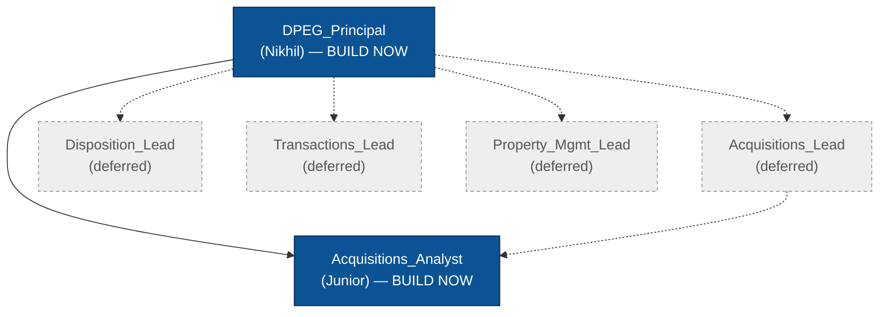
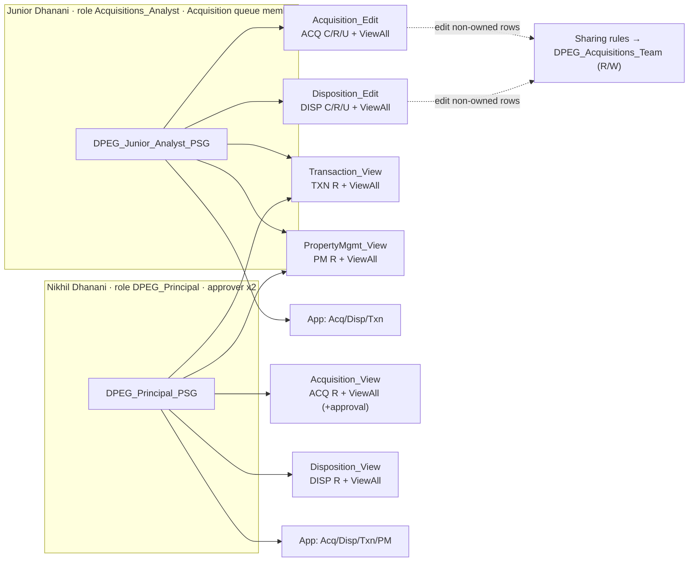

# DPEG — Least-Privilege RBAC: Build-Ready Security Architecture Spec

**Status:** BUILD-READY design (design only — no metadata files created, no deploy).
**Author:** salesforce-solution-architect · **Date:** 2026-07-22
**Source of truth:** `agent-output/design-requirements.md` (Gate-1, approved) + `ARCHITECTURE.md` §1 (object list), §2 (approval services), §4 (portal out of scope).
**Target org:** `usman-dpeg` (EE, treated as UAT). **Next agent:** `salesforce-admin` (build) → `salesforce-devops` (Gate-3 deploy).

> **Confirmed resolutions carried into this spec (do NOT re-open):**
> OQ1 approvers — swap ghost `usman.khan.dpeg` → **Nikhil**, keep `aftab.ali.dpeg.usman` (Ali), keep **Unanimous** on both processes.
> OQ2 queue objects — **Lead + Property__c only**.
> OQ3 Junior edit reach — **team/queue-owned** Acq+Disp (least-privilege sharing), not every record.
> OQ4 OWD — **Opportunity OWD unchanged; Lead → Private**.
> OQ5 approval perm set — folded into `DPEG_Acquisition_View` (no standalone set).
> OQ6 usernames — `junior.dhanani@usmandpeg.uat`, `nikhil.dhanani@usmandpeg.uat` (suffix if globally taken).

---

## 0. The one invariant that governs every persona (read this first)

**Object-level CRUD permission is the ceiling; OWD + sharing + View All only grant row access up to that ceiling.**

- A **View** perm set grants **Read object perm only** → the user is **read-only on that object no matter what OWD or sharing says**. This is why Nikhil stays read-only on Opportunity even though Opportunity OWD is left as-is (possibly Public Read/Write): without the Edit *object* permission he cannot edit any row.
- **View All Records** grants **read to every row** of an object, ignoring OWD/sharing, and **cannot ever grant edit**. It is the read engine for both personas.
- Junior's **edit on rows he does not own** comes **only** from owner-based **sharing rules** (never from View All, never from Modify All).

**Least-privilege invariants (enforced everywhere):**

| Rule | Applied to |
|------|-----------|
| No `allowDelete=true` | any object, either persona |
| No `modifyAllRecords=true` | any object, any perm set |
| `viewAllRecords=true` never set on a ControlledByParent detail object | the 5 PM detail objects (platform rejects it) |
| Edit granted to Junior on non-owned rows only via sharing rules | Acq + Disp only |

---

## 1. OWD Matrix — final `<sharingModel>` for all 33 custom objects + 2 standard

**Principle:** every deal/financial/tenant **master** → **Private**; the 5 master-detail **details** stay `ControlledByParent` (they cannot carry an independent OWD). Read is handed back via **View All**; Junior's cross-owner edit via **sharing rules**. No object is ever `Public Read-Only` — no world-readable tier is needed.

### 1a. 28 custom masters → `Private` (change from `ReadWrite`; set in `<Object>.object-meta.xml`)

| Module | Objects (all → `Private`) |
|--------|---------------------------|
| **ACQ (11)** | `Property__c`, `LOI__c`, `Counter_Offer__c`, `Underwriting__c`, `Development_Feasibility_Review__c`, `Construction_Feasibility_Review__c`, `Contract_Review__c`, `PSA_Version__c`, `Deal_Message__c`, `Offering__c`, `NDA__c` |
| **DISP (5)** | `Disposition__c`, `Disposition_Offer__c`, `BOV_Submission__c`, `Broker_Listing__c`, `Wire__c` |
| **TXN (2)** | `Transaction__c`, `Critical_Date__c` |
| **PM (10)** | `Property_Asset__c`, `Onboarding__c`, `CAM_Reconciliation__c`, `Delinquency__c`, `Insurance_Policy__c`, `Broker_Assignment__c`, `Lease_Inquiry__c`, `Lease__c`, `Lease_Renewal__c`, `Work_Order__c` |

Each: `<sharingModel>Private</sharingModel>` (replace the current `ReadWrite`). Leave `externalSharingModel` at its existing value (portal out of scope, §4).

### 1b. 5 custom details → `ControlledByParent` (UNCHANGED — no edit, no action)

| Detail object | Master (read cascades from) |
|---------------|-----------------------------|
| `Unit__c` | `Property_Asset__c` |
| `Rent_Step__c` | `Unit__c` → `Property_Asset__c` (chained) |
| `Lease_Activity__c` | `Lease_Inquiry__c` |
| `Renewal_Activity__c` | `Lease_Renewal__c` |
| `Work_Order_Activity__c` | `Work_Order__c` |

These inherit row access from their master. A persona with **View All on the master** sees **all details** automatically — this is why the PM detail objects get **no** `viewAllRecords` flag (see §5 / Risk R3).

### 1c. Standard objects — set in **Setup → Sharing Settings** (org), NOT object-meta

| Object | Target OWD | Action |
|--------|-----------|--------|
| **Lead** | **Private** | Change in Sharing Settings. Required for the Acquisition queue to function (queue members auto-see queue-owned leads; assignment rules still route). |
| **Opportunity** | **UNCHANGED** (keep current — verify live value, likely `Public Read/Write`) | **Do not touch.** OQ4: avoids lead-convert / assignment-flow blast radius. Personas are read-capped by the object permission, not by OWD (see §0 and Risk R7). |

### 1d. Grant Access Using Hierarchies

**Keep = ON** for all 28 Private custom masters (platform default). It is the structural backbone (principal reaches subordinates' rows). It is **not** the read mechanism for the two personas — **View All is** (queue-owned and integration-owned rows sit outside the hierarchy; see §3, §6).

> **Admin note:** "Grant Access Using Hierarchies" for custom objects is toggled in **Setup → Sharing Settings**, not in `object-meta.xml`. Default is checked; after the OWD change, **verify** it is still checked for the 28 masters. No action if untouched.

---

## 2. Role Hierarchy

The 18 roles in the repo are the **OOB Salesforce sample set** (CEO/CFO/Sales teams — verified: `CEO`, `CFO`, `COO`, `ChannelSalesTeam`, …). None are DPEG-specific. Build a clean minimal DPEG tree.

### 2a. BUILD NOW (2 roles — minimal to satisfy the 2 users)

| Role API name (file name) | `<name>` (label) | `<parentRole>` | Assigned user |
|---------------------------|------------------|----------------|---------------|
| `DPEG_Principal` | `DPEG Principal` | *(none — top of tree)* | **Nikhil** |
| `Acquisitions_Analyst` | `Acquisitions Analyst` | `DPEG_Principal` | **Junior** |

**Decision on the `Acquisitions_Lead` placeholder: DO NOT build it now.** It would add an empty, unassigned hierarchy level with zero functional benefit for a 2-user org. Re-parenting `Acquisitions_Analyst` under a future `Acquisitions_Lead` is a supported, non-disruptive change — insert it when a lead persona actually exists. So `Acquisitions_Analyst.parentRole = DPEG_Principal` **directly**.

Role files need only `<name>` (+ `<parentRole>` on the child). Omit `opportunityAccessLevel` / `contactAccessLevel` / `caseAccessLevel` — they default and only bind under a Private Opportunity/Account model, which is not in play (Opp OWD unchanged). Do not over-grant them.

### 2b. DESIGNED — NOT BUILT (deferred; add when those personas exist)

```
DPEG_Principal
├── Acquisitions_Lead      (deferred)  → Acquisitions_Analyst re-parents here later
├── Disposition_Lead       (deferred)  → Disposition_Analyst
├── Transactions_Lead      (deferred)  → Transactions_Coordinator
└── Property_Mgmt_Lead     (deferred)  → PM_Coordinator / Leasing_Agent
```

TXN / PM / Disp editor personas are out of scope (design-req §1). Build these roles only when those users are provisioned.

### 2c. Role hierarchy diagram



---

## 3. Public Group `DPEG_Acquisitions_Team`

| Property | Value |
|----------|-------|
| API name (file) | `DPEG_Acquisitions_Team.group-meta.xml` |
| `<name>` (label) | `DPEG Acquisitions Team` |
| Members | **Role & Subordinates:** `Acquisitions_Analyst` · **Role:** `DPEG_Principal` |
| `doesIncludeBosses` | `false` (membership is explicit via the two role entries above; do not auto-inject bosses) |

Membership metadata shape: `<roleAndSubordinates>Acquisitions_Analyst</roleAndSubordinates>` + `<roles>DPEG_Principal</roles>`.

**Purpose:** the single target of every owner-based sharing rule (§4). Sharing rules grant **Read/Write**; each member's **object permission caps effective access** — Junior (Edit sets) = R/W, Nikhil (View sets) = read-only. One R/W rule therefore serves both safely (Nikhil's write is capped away by his read-only object perm). Nikhil's membership is redundant for read (he has View All) but is kept for hierarchy consistency and future-proofing; it is harmless.

> **Collision note:** an existing empty group `Acquisitions_Team` (label "Acquisitions Team") is in the repo with **no members**. Do **not** reuse or modify it — build the distinct `DPEG_Acquisitions_Team`. The `DPEG_` prefix disambiguates the API name.

---

## 4. Sharing Rules

**The whole read layer needs ZERO sharing rules.** Read for every object, both personas, is delivered by **View All** on the perm sets (§5). Sharing rules exist **only** to give **Junior** Read/Write on Acq+Disp rows he does not own. All rules are **owner-based**, target **`DPEG_Acquisitions_Team`**, access **Read/Write**. There are **no criteria-based rules** (OQ3 rejected "every record").

Two owner sources feed the team group's write access:
- **(a) the Acquisition QUEUE** — for the queue-owned intake objects (Lead, Property__c). *Live now.*
- **(b) the `Acquisitions_Analyst` ROLE & Subordinates** — for rows owned by a *team member other than the viewer*.

### 4a. Which objects need a rule vs. covered by View All alone

| Object group | Read | Junior cross-owner Edit | Sharing rule needed? |
|--------------|------|-------------------------|----------------------|
| **All TXN (2)** | View All | — (Junior read-only) | **No rule** — View All only |
| **All PM (15, incl. 5 details)** | View All | — (Junior read-only) | **No rule** — View All only (details via master's View All) |
| **ACQ — Lead, Property__c** | View All | queue-owned intake | **Yes — queue → group R/W** (4b) |
| **ACQ — the 11 other objects + Opportunity** | View All | owned rows = ownership; team-member rows = role rule | ownership covers it now; role rule = **deferred template** (4d) |
| **DISP (5 masters)** | View All | team-member rows | **Yes — role → group R/W** (4c, task-mandated) |

### 4b. BUILD NOW — Queue-owned intake (2 rules, load-bearing)

| # | Dev name | Object | Type | Source | Target | Access |
|---|----------|--------|------|--------|--------|--------|
| SR-01 | `Lead_Acquisition_Queue_RW` | `Lead` | Owner-based | **Queue:** `Acquisition` | `DPEG_Acquisitions_Team` | Read/Write |
| SR-02 | `Property_Acquisition_Queue_RW` | `Property__c` | Owner-based | **Queue:** `Acquisition` | `DPEG_Acquisitions_Team` | Read/Write |

These make the team's edit grant on queue-owned records **explicit and auditable**, and independent of queue membership (any group member — not only queue members — can co-work intake). *(Junior additionally gets R/W on queue-owned rows via queue membership itself — see §7; SR-01/02 are the durable, auditable mechanism and future-proof non-member teammates.)*

### 4c. BUILD NOW — Team-owned Disposition (5 rules, task-mandated)

One owner-based rule per DISP master, all identical shape:

| # | Dev name | Object | Type | Source | Target | Access |
|---|----------|--------|------|--------|--------|--------|
| SR-03 | `Disposition_Team_RW` | `Disposition__c` | Owner-based | **Roles & Subordinates:** `Acquisitions_Analyst` | `DPEG_Acquisitions_Team` | Read/Write |
| SR-04 | `Disposition_Offer_Team_RW` | `Disposition_Offer__c` | Owner-based | Roles & Subordinates: `Acquisitions_Analyst` | `DPEG_Acquisitions_Team` | Read/Write |
| SR-05 | `BOV_Submission_Team_RW` | `BOV_Submission__c` | Owner-based | Roles & Subordinates: `Acquisitions_Analyst` | `DPEG_Acquisitions_Team` | Read/Write |
| SR-06 | `Broker_Listing_Team_RW` | `Broker_Listing__c` | Owner-based | Roles & Subordinates: `Acquisitions_Analyst` | `DPEG_Acquisitions_Team` | Read/Write |
| SR-07 | `Wire_Team_RW` | `Wire__c` | Owner-based | Roles & Subordinates: `Acquisitions_Analyst` | `DPEG_Acquisitions_Team` | Read/Write |

> **Transparency:** with a *single* Acquisitions analyst, SR-03..07 are **latent** — Junior already edits Disp rows he owns via ownership, and reads all via View All. They become live the moment a *second* Acquisitions-team analyst owns a Disp row. They are built now because task-mandated ("team-owned Disp") and to guarantee zero rework on team growth. They are strictly least-privilege (scoped to team-owned, never "all records").

### 4d. DEFERRED template — Team-owned ACQ deal graph (build when a 2nd Acquisitions analyst is provisioned)

Same shape as 4c, one per ACQ object (`Property__c`, `LOI__c`, `Counter_Offer__c`, `Underwriting__c`, `Development_Feasibility_Review__c`, `Construction_Feasibility_Review__c`, `Contract_Review__c`, `PSA_Version__c`, `Deal_Message__c`, `Offering__c`, `NDA__c`, and `Lead`), source **Roles & Subordinates: `Acquisitions_Analyst`** → `DPEG_Acquisitions_Team` R/W. **Not built now** — with one analyst they are pure no-op self-shares (the owner already has R/W via ownership; Nikhil already reads via View All). Building them now adds clutter with zero effect. The template above makes the future add a mechanical, zero-design task.

**Opportunity (standard):** OWD is left unchanged (OQ4). Junior's Opportunity edit scope is therefore governed by the **live Opportunity OWD + his Edit object perm**, not by a sharing rule. If live Opp OWD = `Public Read/Write`, Junior can edit **all** opportunities (accepted trade-off, Risk R7); a sharing rule would be inert. If the admin finds Opp OWD is `Public Read-Only` or `Private`, add `Opportunity_Team_RW` (owner-based, Roles & Subordinates `Acquisitions_Analyst` → group, R/W) so team-owned deals stay editable.

---

## 5. Permission Sets (10) — object perms, FLS scope, tab/app assignment

**Groups:** ACQ = 13 {Opportunity, Lead, Property__c, LOI__c, Counter_Offer__c, Underwriting__c, Development_Feasibility_Review__c, Construction_Feasibility_Review__c, Contract_Review__c, PSA_Version__c, Deal_Message__c, Offering__c, NDA__c}. DISP = 5. TXN = 2. PM = 15 (incl. the 5 details).

### 5a. The 6 functional sets — object permissions

Object-perm flags are `allowRead / allowCreate / allowEdit / allowDelete / viewAllRecords / modifyAllRecords`.

| # | Perm set (API name) | Objects | R | C | E | **D** | **ViewAll** | **ModAll** |
|---|--------------------|---------|:-:|:-:|:-:|:-:|:-:|:-:|
| 1 | `DPEG_Acquisition_Edit` | ACQ (13) | ✅ | ✅ | ✅ | ❌ | ✅ | ❌ |
| 2 | `DPEG_Acquisition_View` | ACQ (13) | ✅ | ❌ | ❌ | ❌ | ✅ | ❌ |
| 3 | `DPEG_Disposition_Edit` | DISP (5) | ✅ | ✅ | ✅ | ❌ | ✅ | ❌ |
| 4 | `DPEG_Disposition_View` | DISP (5) | ✅ | ❌ | ❌ | ❌ | ✅ | ❌ |
| 5 | `DPEG_Transaction_View` | TXN (2) | ✅ | ❌ | ❌ | ❌ | ✅ | ❌ |
| 6 | `DPEG_PropertyMgmt_View` | PM (15) | ✅ | ❌ | ❌ | ❌ | ✅* | ❌ |

**\*PM ViewAll rule (critical — prevents a deploy failure):** set `viewAllRecords=true` on the **10 PM masters only**. On the **5 detail objects** (`Unit__c`, `Rent_Step__c`, `Lease_Activity__c`, `Renewal_Activity__c`, `Work_Order_Activity__c`) set `allowRead=true` and **omit `viewAllRecords`** — the platform **rejects View All / Modify All on the detail side of a master-detail relationship**. Read-all for the 5 details is delivered by their master's View All via `ControlledByParent` (§1b). Same rule holds anywhere a detail appears; note ACQ/DISP/TXN have **no** detail objects, so their sets set View All on every listed object.

Notes:
- `DPEG_Acquisition_Edit` carries **View All (read)** so Junior *sees* every ACQ row; his **edit** on non-owned rows is the sharing rules (§4), never View All. Same pattern for `DPEG_Disposition_Edit`.
- **Approval visibility (OQ5) is folded into `DPEG_Acquisition_View`** — approval *acting* rights come from being the named approver (a process assignment, not a permission) + Read on Opportunity, which set 2 already grants (Read + View All on Opportunity). No standalone approval perm set.
- No set anywhere grants `allowDelete` or `modifyAllRecords` (§0 invariants).

### 5b. FLS scope — exact derivation the admin must follow (do not free-hand)

FLS is **not in the repo** (profiles are `.forceignore`d). Each `*_View` / `*_Edit` set must enumerate `<fieldPermissions>` for its objects. Derive **from current field metadata**, accelerated by existing perm-set enumerations — then apply the edit-flag rule.

**Step 1 — build the candidate field list per set:**
- Enumerate every custom field of the set's objects from `force-app/main/default/objects/<Object>/fields/*.field-meta.xml` (this is the authoritative, current list — 463 custom fields across 33 objects).
- Accelerate by copying the existing enumerations, but **reconcile** (see Risk R2 — the §1 conformance renames changed field API names):
  - **ACQ** (sets 1, 2): reuse the field list from **`DPEG_Acquisitions`** (346 fields), incl. its standard **Lead / Opportunity** field entries. Reconcile against current metadata; add any ACQ field it is missing.
  - **DISP** (sets 3, 4): `DPEG_Acquisitions` and `Disposition_Dashboard_Access` carry Disposition FLS — source from there; where neither covers a DISP field, enumerate directly from the object's `fields/` dir.
  - **TXN** (set 5): reuse **`Transaction_App_Access`** (44 fields).
  - **PM** (set 6): reuse **`Property_Management_Access`** (183 fields), incl. the 5 detail objects' fields.

**Step 2 — drop fields that cannot carry FLS (exclude entirely — never list them):**
- Required fields (`<required>true</required>`) — including **every master-detail field** (always required on the detail). They are visible/editable by default whenever the object is accessible; an FLS entry on them **fails deployment**.
- The Name field and system/audit fields (no `<fieldPermissions>` entry exists for these).

**Step 3 — set the edit flag on the remaining fields:**
- In **every `*_View` set** (2, 4, 5, 6): `readable=true, editable=false` for **all** fields.
- In **each `*_Edit` set** (1, 3): `readable=true, editable=true` **EXCEPT** set `editable=false` (read-only, i.e. `readable=true` only) for:
  - **Formula** fields (`<formula>` present) — an editable FLS on a formula field is invalid.
  - **Roll-up summary** fields (`<type>Summary</type>`).
  - **Auto-number** fields (`<type>AutoNumber</type>`).
  These are the exact §1-conformance-touched read-only fields to double-check by name: `Days_On_Market__c`, `Cash_On_Cash_Return__c`, `Projected_Value_At_Peak__c`, `Readiness_Score__c`, `Occupied_Pct__c` (formula/number — read-only where formula).

**Result:** `*_Edit` = R/W FLS on writable fields + Read-only FLS on computed fields; `*_View` = Read-only FLS everywhere. Missing FLS = blank fields / "No such column" for the persona and is **invisible to an admin tester** (admin passes via profile) → must be caught by the §10 persona acceptance test.

### 5c. The 4 app/tab-visibility sets (7–10)

Each grants `applicationVisibilities` (visible=true) for its app + `tabSettings` (Visible) for **every tab in that app's navigation** (enumerated below from the live `*.app-meta.xml`). Tab-name syntax: custom object tabs use `__c`; custom (non-object) tabs use the tab dev name; standard tabs use `standard-<Name>`.

| # | Perm set (API name) | `<application>` | Tabs → `Visible` |
|---|--------------------|-----------------|------------------|
| 7 | `DPEG_App_Acquisition` | `Acquisition` | `Lead_Funnel`, `Broker_Hub`, `standard-Lead`, `standard-Opportunity`, `standard-report`, `Acquisition_Dashboard` |
| 8 | `DPEG_App_Disposition` | `Disposition` | `Sell_Meter`, `Disposition__c`, `Broker_Hub`, `standard-report`, `Disposition_Dashboard` |
| 9 | `DPEG_App_Transaction` | `Transaction` | `Active_Transactions`, `Transaction__c`, `standard-report`, `Transaction_Dashboard` |
| 10 | `DPEG_App_PropertyMgmt` | `Property_Management` | `Onboarding`, `Broker_Assignments`, `Lease_Activity_Tracker`, `Lease_Renewals`, `Onboarding__c`, `Broker_Assignment__c`, `Lease_Inquiry__c`, `Lease_Renewal__c`, `Property_Management_Dashboard`, `Leasing_Dashboard`, `Work_Order_Dashboard` |

App assignment (via PSGs, §6): **Junior → 7, 8, 9** (no PM app — he reads PM data via cross-module lookups only, deliberate). **Nikhil → 7, 8, 9, 10** (all four apps).

---

## 6. Permission Set Groups (2) + user→PSG assignment

| PSG (API name) | Member perm sets | Assigned to |
|----------------|------------------|-------------|
| `DPEG_Junior_Analyst_PSG` | `DPEG_Acquisition_Edit` (1), `DPEG_Disposition_Edit` (3), `DPEG_Transaction_View` (5), `DPEG_PropertyMgmt_View` (6), `DPEG_App_Acquisition` (7), `DPEG_App_Disposition` (8), `DPEG_App_Transaction` (9) | **Junior** |
| `DPEG_Principal_PSG` | `DPEG_Acquisition_View` (2), `DPEG_Disposition_View` (4), `DPEG_Transaction_View` (5), `DPEG_PropertyMgmt_View` (6), `DPEG_App_Acquisition` (7), `DPEG_App_Disposition` (8), `DPEG_App_Transaction` (9), `DPEG_App_PropertyMgmt` (10) | **Nikhil** |

- Sets **5** and **6** are shared members of both PSGs — valid (a perm set may belong to many PSGs).
- No user ever holds both `*_Edit` and `*_View` for the same module (Junior=Edit, Nikhil=View) → no conflict.
- Assign the PSG to the user (not the individual sets) so composition stays managed in one place.



---

## 7. Queue Specification — `Acquisition`

| Property | Value |
|----------|-------|
| API name (file) | `Acquisition.queue-meta.xml` |
| `<name>` (label) | `Acquisition` |
| `queueSobject` | `Lead`, `Property__c` (two entries) |
| `doesIncludeBosses` | `true` (matches the existing `Broker_Portal_Leads` pattern; also lets DPEG_Principal reach queue records via hierarchy — harmless, Nikhil already has View All) |
| `doesSendEmailToMembers` | `false` |
| Member | **Junior** (`junior.dhanani@usmandpeg.uat`) |

**Membership caveat (operational):** the existing `Broker_Portal_Leads` queue carries **no members in its repo metadata** — membership in this org is managed in-org, not via source. Create the queue metadata (name + 2 `queueSobject` + flags), then **add Junior as a member in Setup → Queues → Acquisition → Queue Members** (Users). If the org accepts `<queueMembers>` at API 67 on deploy, include it; if the deploy strips it (as the existing queue suggests), add via UI.

**Why user-direct, not the role:** for the 2-user scope, add **Junior (user)**. Adding the `Acquisitions_Analyst` role instead would auto-enroll future analysts — revisit when the team grows.

**Constraints the admin must respect:**
- **Opportunity cannot be queue-owned** — the deal is always user-owned; not in `queueSobject`.
- All 11 Acquisition custom objects are lookup-based (none are master-detail details) → all have `OwnerId` and are queue-eligible; limiting to Lead + Property__c is a **design** choice (OQ2), not a technical limit.
- **Coexistence with `Broker_Portal_Leads`:** two Lead queues coexist fine. **Verify Lead assignment rules** — the Broker Portal guest insert (`LeadSource = 'Broker Portal'`) must keep routing to `Broker_Portal_Leads`, **not** the new `Acquisition` queue. Do not point existing assignment rules at `Acquisition` unless DPEG explicitly wants auto-routing there; the Acquisition queue is a **manual triage pool**.

---

## 8. Approval Repoint — `LOI_Approval` + `Underwriting_Approval`

**Confirmed target (OQ1):** replace ghost `usman.khan.dpeg@avanzasolutions.com` → **Nikhil** (`nikhil.dhanani@usmandpeg.uat`); **keep** `aftab.ali.dpeg.usman@avanzasolutions.com` (Ali); **keep `whenMultipleApprovers = Unanimous`.** Apply identically to both.

**Repo ground truth (verified):** both processes are `active=true`, `allowRecall=true`, `recordEditability=AdminOnly`, single approval step with the two `<approver>` users + `Unanimous`. LOI step = `LOI_Approval_Step`; Underwriting step = `Principal_Review_Step` (description documents "Both principals (Ali + Nikhil) must approve — unanimous"). The repoint keeps the two-principal design and simply substitutes the real Nikhil user for the placeholder.

**Operational sequence (per process; do LOI then Underwriting):**

1. **Verify the LIVE org first** — repo ≠ org drift is possible. In Setup → Approval Processes, confirm the current step approvers actually are `usman.khan.dpeg` + `aftab.ali.dpeg.usman` / Unanimous before changing anything.
2. **Confirm Nikhil is ready** — the new Nikhil user must be **active**, hold a **Salesforce license**, and have **Read on Opportunity** (delivered by `DPEG_Principal_PSG` → `DPEG_Acquisition_View`). An approval process cannot reference an inactive user. **Do the repoint AFTER §5/§6 assign Nikhil's PSG.**
3. **Recall pending requests** — an active process **cannot be deactivated while approval requests are pending**. Recall any in-flight submissions first (record Approval History → Recall, or admin recall).
4. **Deactivate** the process (`active=false`). An active process's steps cannot be edited.
5. **Edit the step approvers** — remove `usman.khan.dpeg@avanzasolutions.com`, add `nikhil.dhanani@usmandpeg.uat`; **leave** `aftab.ali.dpeg.usman@avanzasolutions.com` and `whenMultipleApprovers=Unanimous` untouched.
6. **Reactivate** (`active=true`).
7. **Repeat 3–6** for `Underwriting_Approval` (`Principal_Review_Step`).
8. **Verify** — as Junior, submit a test Opportunity into the LOI stage (then Underwriting stage); confirm **both** Nikhil and Ali receive the request and Unanimous holds (one rejection ends it). `recordEditability=AdminOnly` is fine — the named approver can approve/reject without record edit.

> If done via Metadata API rather than UI: deploy the updated `approvalProcess` in **two passes** (pass 1 `active=false`; pass 2 new approver + `active=true`) — a single deploy that edits the step of an active process fails. The ghost `usman.khan.dpeg` user is left as-is (out of scope to modify existing users); it is simply no longer referenced.

---

## 9. Users (2)

Both on standard **Minimum Access – Salesforce** profile, **Salesforce (full) license** (required for standard-object apps + approvals). Created in **Setup → Users** (activation email + license are org operations; not source-deployed).

| Field | Junior Dhanani | Nikhil Dhanani |
|-------|----------------|----------------|
| Username (globally unique) | `junior.dhanani@usmandpeg.uat` | `nikhil.dhanani@usmandpeg.uat` |
| Notification/activation email | `usmankhan-96@hotmail.com` | `usmanthehitman@gmail.com` |
| Alias | `jdhan` | `ndhan` |
| Profile | Minimum Access – Salesforce | Minimum Access – Salesforce |
| Role | `Acquisitions_Analyst` | `DPEG_Principal` |
| Queue membership | `Acquisition` | — |
| PSG | `DPEG_Junior_Analyst_PSG` | `DPEG_Principal_PSG` |
| Approver on | — | `LOI_Approval`, `Underwriting_Approval` |

If `@usmandpeg.uat` is globally taken, suffix (e.g. `junior.dhanani@usmandpeg.uat.01`). Set locale / timezone / language to org defaults at creation.

---

## 10. Build Order + Persona Acceptance Test

### 10a. Dependency-ordered build order

1. **Roles** — `DPEG_Principal`, then `Acquisitions_Analyst` (child). *(needed before users, group, role-based sharing)*
2. **Public group** `DPEG_Acquisitions_Team` *(references both roles)*
3. **Users** — Junior → `Acquisitions_Analyst`; Nikhil → `DPEG_Principal`
4. **Permission sets** — 6 functional (full FLS per §5b) + 4 app; then **2 PSGs**
5. **Assign PSGs** — Junior → `DPEG_Junior_Analyst_PSG`; Nikhil → `DPEG_Principal_PSG` *(Nikhil now has Opportunity Read — prerequisite for the approval repoint)*
6. **Queue** `Acquisition` (+ `Lead`, `Property__c` `queueSobject`; add Junior member in-org)
7. **OWD tighten** — 28 custom masters → `Private`; Lead → Private (Sharing Settings); Opportunity **unchanged**; verify Grant-Access-Using-Hierarchies ON. *(triggers org-wide sharing recalculation — see R1)*
8. **Sharing rules** — SR-01..07 *(after OWD Private + group + roles + queue exist; rules on a Public R/W object are inert)*
9. **Approval repoint** — LOI then Underwriting (recall pending → deactivate → edit approver → reactivate)
10. **Persona acceptance test** (10b) — an admin smoke test proves nothing; FLS/USER_MODE gaps are invisible to admins.

### 10b. Persona acceptance-test checklist

**Log in AS JUNIOR (`jdhan`):**
- App Launcher shows **Acquisition, Disposition, Transaction**; **Property Management app is absent**.
- **Acquisition:** create a Lead / Opportunity / LOI; **edit** a record he owns; **accept & edit** a Lead and a Property from the **Acquisition queue** list view; **read** an ACQ record owned by someone else (View All); **Delete button absent / delete fails** on every ACQ object.
- **Disposition:** create + edit an owned Disposition/Wire; read all (View All); no delete.
- **Transaction:** open a Transaction / Critical Date → **read-only** (no Edit/New; edit is blocked); can read **all** rows.
- **Property Management:** reach a `Property_Asset__c` (or Unit/Rent_Step detail) via a lookup/related list from a Disposition → **renders read-only**, no blank fields; no PM tabs in nav.
- **FLS spot-check:** open an Underwriting and a Disposition record → all expected fields render, **no "No such column" / blank**; specifically verify the renamed fields `Days_On_Market__c`, `Cash_On_Cash_Return__c`, `Projected_Value_At_Peak__c` display.
- **No Setup access** (no admin).

**Log in AS NIKHIL (`ndhan`):**
- App Launcher shows **all 4 apps**.
- Every module (ACQ/DISP/TXN/PM): **read all** rows (View All); **New/Edit/Delete absent or blocked everywhere** (read-only principal). Confirm even Opportunity is non-editable despite its unchanged OWD (proves object-perm ceiling, §0).
- Reads an **Acquisition-queue-owned** Lead/Property **without** being a queue member (View All).
- **Approvals:** have Junior submit a test Opportunity (LOI stage, then Underwriting stage) → Nikhil **receives** the approval request; both Nikhil **and** Ali are required (**Unanimous**); Nikhil can **approve/reject** even though read-only on Opportunity. Approval-page fields render (no blanks).

**Regression check — log in AS AN EXISTING power user** (someone assigned `DPEG_Acquisitions` / `Property_Management_Access`) **after step 7**: confirm they still see the records they need. This is the highest-risk item (R1).

---

## 11. Risks (flagged — includes NEW findings beyond the design doc)

| # | Risk | Severity | Mitigation |
|---|------|:--------:|-----------|
| **R1** ⭐NEW-elevated | **OWD→Private blast radius on EXISTING personas, not just the 2 new users.** Existing sets (`DPEG_Acquisitions`, `Property_Management_Access`, `Transaction_App_Access`) grant broad C/E/D but may **lack View All**. Under Private OWD they lose visibility to rows they don't own. Compounded by `WITH USER_MODE` selectors (ARCH §2) → dashboards/LWCs can **silently** return empty for non-admins. | **High** | Before step 7, audit each existing set for View All coverage on its objects. If a persona regresses, remediate with a **new additive** View-All perm set assigned to those users (stays within "do not modify existing sets"). Regression-test per §10b. Not a blocker for the 2 new personas (they have View All). |
| **R2** ⭐NEW | **FLS copied from existing perm sets may reference pre-conformance field API names.** The §1 conformance program renamed/recreated fields (`Days_on_Market`→`Days_On_Market`, `Cash_on_Cash_Return`→`Cash_On_Cash_Return`, etc.) and left stale `<fieldPermissions>` stubs in forceignored profiles. Blind copy → missing/blank fields. | **High** | Source FLS from **current** `fields/*.field-meta.xml`; diff against the existing set's enumeration; drop stubs for deleted fields. |
| **R3** ⭐NEW | **`viewAllRecords=true` on a ControlledByParent detail fails deployment.** Setting View All on the 5 PM details (`Unit__c`, `Rent_Step__c`, `Lease_Activity__c`, `Renewal_Activity__c`, `Work_Order_Activity__c`) is rejected by the platform. | **Medium** | Set View All only on the 10 PM masters; details get `allowRead` only; read-all cascades via the master (§5a). |
| **R4** ⭐NEW | **Queue membership already grants edit on queue-owned rows** — SR-01/02 partly overlap Junior's queue-member access; and **queue members may not deploy via metadata** (existing `Broker_Portal_Leads` has none in repo). | Low | Keep SR-01/02 as the explicit/auditable grant; add Junior to the queue **in-org** (§7). |
| **R5** | **Approval repoint blocked by pending requests / inactive approver.** | Medium | Recall pending first; ensure Nikhil is active + licensed + Opportunity-readable **before** editing (step 5 after PSG assign). |
| **R6** | **Two Lead queues** — assignment rules could misroute Broker-Portal leads to the new queue. | Medium | Verify Lead assignment rules keep `LeadSource='Broker Portal'` → `Broker_Portal_Leads`. |
| **R7** (accepted) | **Opportunity OWD unchanged ⇒ Junior may edit ALL opportunities.** If live Opp OWD = Public R/W, Junior's Edit object perm lets him edit every Opp, exceeding the "team/queue-owned" intent **for the Opportunity object only**. There is no way to scope Opp edit to team-owned without tightening Opp OWD, which OQ4 declined. | Accepted | Conscious OQ4 trade-off (avoids lead-convert blast radius). If unacceptable later, tighten Opp OWD + add `Opportunity_Team_RW` (§4d). Nikhil is unaffected (read-only via object perm). |
| **R8** | **Property__c dual identity** — Junior **edits** `Property__c` (Acquisition target) but is **read-only** on `Property_Asset__c` (PM root). | Low | Intended; verified distinct objects. Confirm in §10b (Junior edits Property__c, only reads Property_Asset__c). |
| **R9** | **Missing FLS is invisible to admin testers.** | Medium | Mandatory persona login test (§10b), not an admin smoke test. |

---

## 12. What this spec does NOT change (guardrails for the admin)

- **No existing perm set or user is modified** — the model is strictly additive (except the two approval processes, whose repoint is the explicitly-requested change).
- **No Apex / LWC / Flow / validation rule / field creation** — declarative security only.
- **No Experience Cloud / Investor Portal / IR-module** sharing (ARCH §4; those objects were never built).
- **No `Modify All` and no `Delete`** anywhere in the 10 perm sets.
- **No deploy** — hand off to `salesforce-devops` at Gate-3.

---

*End of build-ready RBAC spec. Everything above is decided — no open questions remain. Route to `salesforce-admin` for the metadata build (files only, no deploy).*
