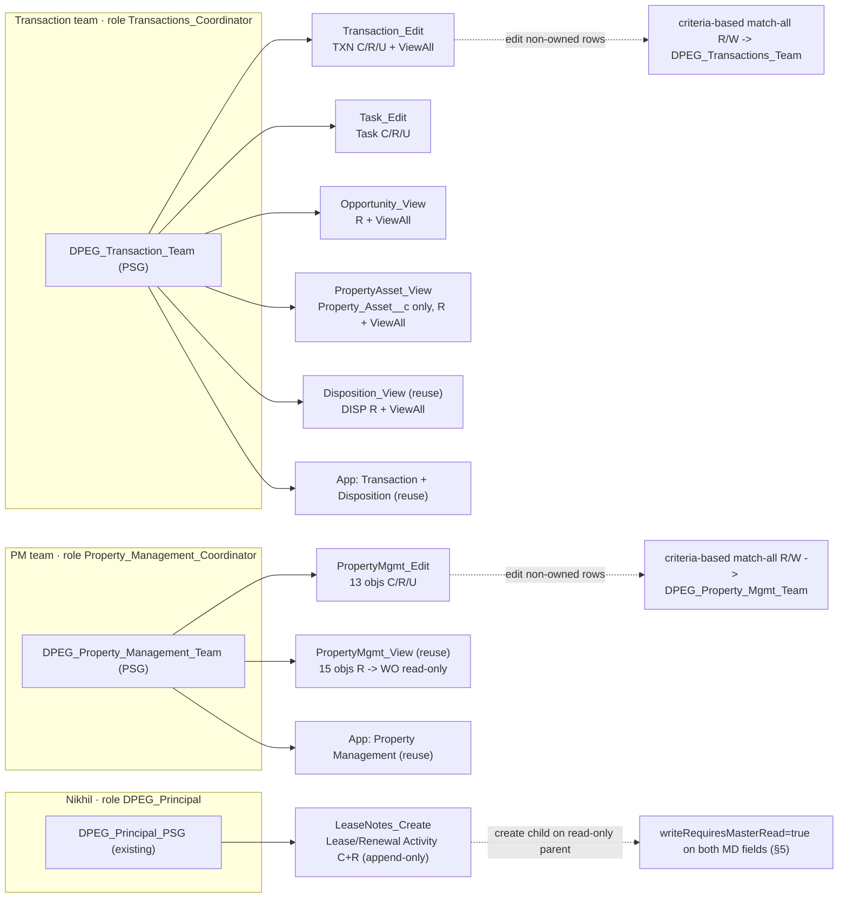
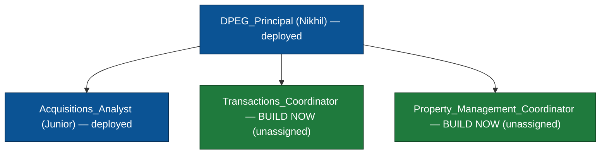

# DPEG RBAC — Transaction Team + PM Team + Nikhil Notes: Build-Ready Extension Spec

**Status:** BUILD-READY design (design only — no metadata files created, no deploy).
**Author:** salesforce-solution-architect · **Date:** 2026-07-22
**Extends (do not rebuild):** `docs/rbac-access-model-standard.md` (model + Option C naming) and `agent-output/rbac-architecture-spec.md` (deployed baseline).
**Grounded in:** `ARCHITECTURE.md` §1 (object graph; which objects are ControlledByParent details vs. lookup masters vs. Yardi read-only mirrors) and §3 (Yardi = no write-back).
**Next agent:** `salesforce-admin` (metadata build, files only) → `salesforce-devops` (Gate-3 deploy). **User creation is out of scope** (deferred, see §8).

---

## 0. What is already deployed (the baseline this spec extends)

Treat all of the following as **immutable** — this spec is strictly **additive** except for the two `writeRequiresMasterRead` field-meta flips in §5, which are the explicitly-requested change.

- **OWD:** Private on 28 custom masters; 5 details `ControlledByParent`; Lead Private; Opportunity unchanged.
- **Roles:** `DPEG_Principal` (Nikhil), `Acquisitions_Analyst` (Junior).
- **Public group:** `DPEG_Acquisitions_Team`.
- **Sharing rules:** SR-01..07 (Lead/Property queue-owned + 5 Disposition team-owned) → `DPEG_Acquisitions_Team`.
- **Perm sets:** `DPEG_Acquisition_Edit/View`, `DPEG_Disposition_Edit/View`, `DPEG_Transaction_View`, `DPEG_PropertyMgmt_View`, `DPEG_App_{Acquisition,Disposition,Transaction,PropertyMgmt}`.
- **PSGs:** `DPEG_Junior_Analyst_PSG`, `DPEG_Principal_PSG`.

### The governing invariant (unchanged from the baseline — read first)

> **Object-CRUD is the ceiling. OWD + sharing + View All only grant row access up to that ceiling.**
> - A **View** set = Read object perm only → the user is read-only on that object no matter what sharing says.
> - **View All Records** = read every row, ignoring OWD/sharing; **can never grant edit**. It is the read engine.
> - **Edit on rows a user does not own** comes **only** from sharing rules — never from View All, never from Modify All.

**Least-privilege rails enforced everywhere in this spec:** no `allowDelete=true`, no `modifyAllRecords=true`, and `viewAllRecords=true` is **never** set on a `ControlledByParent` detail (platform rejects it — baseline Risk R3).

---

## 1. At a glance — what this spec adds

| Persona | New PSG | New building blocks | Reuses (deployed) |
|---|---|---|---|
| **Transaction team** | `DPEG_Transaction_Team` | `DPEG_Transaction_Edit`, `DPEG_Task_Edit`, `DPEG_Opportunity_View`, `DPEG_PropertyAsset_View` | `DPEG_Disposition_View`, `DPEG_App_Transaction`, `DPEG_App_Disposition` |
| **PM team** | `DPEG_Property_Management_Team` | `DPEG_PropertyMgmt_Edit` | `DPEG_PropertyMgmt_View`, `DPEG_App_PropertyMgmt` |
| **Nikhil (extend)** | *(add one member to existing `DPEG_Principal_PSG`)* | `DPEG_LeaseNotes_Create` + 2 field-meta flips | `DPEG_PropertyMgmt_View` (already gives him Read on the parents + activities) |

**Net new metadata:** 6 permission sets · 2 permission set groups (+1 PSG member addition) · 2 public groups · 2 roles · 11 sharing rules · 2 field-meta edits. **No user records** (§8).

**Object counts used throughout (from `ARCHITECTURE.md` §1):**
- **TXN masters (2):** `Transaction__c`, `Critical_Date__c` (both lookup masters, own `OwnerId`/OWD — *verified: `Critical_Date__c.Transaction__c` is a Lookup, not MD*).
- **PM (15) = 10 masters + 5 details.** Masters: `Property_Asset__c`, `Onboarding__c`, `CAM_Reconciliation__c`, `Delinquency__c`, `Insurance_Policy__c`, `Broker_Assignment__c`, `Lease_Inquiry__c`, `Lease__c`, `Lease_Renewal__c`, `Work_Order__c`. Details (`ControlledByParent`): `Unit__c`, `Rent_Step__c`, `Lease_Activity__c`, `Renewal_Activity__c`, `Work_Order_Activity__c`.
- **PM editable (13)** = the 15 minus `Work_Order__c` + `Work_Order_Activity__c` (Yardi read-only mirror, §3 no write-back). Editable = **9 masters** (`Work_Order__c` removed) + **4 details** (`Work_Order_Activity__c` removed).

---

## 2. New permission sets (6) — object perms + FLS derivation + View All placement

Option C naming: **API** `DPEG_<Scope>_<Access>` · **Label** spaced + separator · **Description** one plain sentence. Object-perm flags: `allowRead / allowCreate / allowEdit / allowDelete / viewAllRecords / modifyAllRecords`.

### 2a. Object permissions

| # | API Name | Label | Object(s) | R | C | E | D | ViewAll | ModAll |
|---|---|---|---|:-:|:-:|:-:|:-:|:-:|:-:|
| 1 | `DPEG_Transaction_Edit` | Transaction – Edit | `Transaction__c`, `Critical_Date__c` | ✅ | ✅ | ✅ | ❌ | ✅ | ❌ |
| 2 | `DPEG_Task_Edit` | Task – Edit | `Task` (standard) | ✅ | ✅ | ✅ | ❌ | ❌ⁱ | ❌ |
| 3 | `DPEG_Opportunity_View` | Opportunity – View Only | `Opportunity` | ✅ | ❌ | ❌ | ❌ | ✅ | ❌ |
| 4 | `DPEG_PropertyAsset_View` | Property Asset – View Only | `Property_Asset__c` **only** | ✅ | ❌ | ❌ | ❌ | ✅ | ❌ |
| 5 | `DPEG_PropertyMgmt_Edit` | Property Management – Edit | 13 editable PM objects (below) | ✅ | ✅ | ✅ | ❌ | ✅ᵐ | ❌ |
| 6 | `DPEG_LeaseNotes_Create` | Lease Notes – Create | `Lease_Activity__c`, `Renewal_Activity__c` | ✅ | ✅ | ❌ | ❌ | ❌ᵈ | ❌ |

**Set 5 — `DPEG_PropertyMgmt_Edit` object rows (exact):**
- **9 editable masters** → `allowRead + allowCreate + allowEdit + viewAllRecords=true` (no Delete, no ModAll): `Property_Asset__c`, `Onboarding__c`, `CAM_Reconciliation__c`, `Delinquency__c`, `Insurance_Policy__c`, `Broker_Assignment__c`, `Lease_Inquiry__c`, `Lease__c`, `Lease_Renewal__c`.
- **4 editable details** → `allowRead + allowCreate + allowEdit` **only, OMIT `viewAllRecords`** (superscript ᵐ / Risk R3): `Unit__c`, `Rent_Step__c`, `Lease_Activity__c`, `Renewal_Activity__c`. Their read-all cascades from the master's View All via `ControlledByParent`; their edit flows from master R/W sharing (§4).
- **`Work_Order__c` + `Work_Order_Activity__c` are NOT in this set** — deliberately excluded. Their read-only access is supplied by reusing the deployed `DPEG_PropertyMgmt_View` in the PSG (§3). This keeps `DPEG_PropertyMgmt_Edit` a clean edit-only block and encodes the §3 no-write-back rule structurally.

**Footnotes on View All placement (masters only, never details — R3):**
- **ⁱ (Set 2, Task):** do **not** set `viewAllRecords` on `Task`. Activity row visibility derives from the parent record (the team has View All on `Transaction__c`, so they see all transaction-related tasks). See §4 "Task under the Activity model."
- **ᵐ (Set 5):** View All on the **9 masters only**; the **4 details** get `allowRead` with **no** View All.
- **ᵈ (Set 6):** `Lease_Activity__c` / `Renewal_Activity__c` are `ControlledByParent` details → **no View All** (R3). Nikhil's read of them already comes from `DPEG_PropertyMgmt_View` (via each master's View All). This set adds only **Create** (+ redundant-but-harmless Read).

### 2b. FLS derivation — the exact rule the admin follows per set (do not free-hand)

FLS is **not in the repo** (profiles are `.forceignore`d). Each set must enumerate `<fieldPermissions>`. **Baseline Risk R2 still applies:** the §1 conformance program renamed/recreated fields and left stale field-permission stubs in forceignored profiles — so **source from current `force-app/main/default/objects/<Object>/fields/*.field-meta.xml`**, accelerate by copying an existing set's enumeration, then **reconcile** (diff, drop stale names, add any missing).

**Universal exclusions (never emit a `<fieldPermissions>` entry — they fail deploy):**
- Required fields (`<required>true</required>`), **including every master-detail field** (always required on the detail).
- The Name field and all system/audit fields.

**Universal edit-flag rule:**
- In a **`*_View`** set → `readable=true, editable=false` for **every** field.
- In a **`*_Edit`** / **create** set → `readable=true, editable=true` **EXCEPT** force `editable=false` (read-only) on **Formula** (`<formula>` present), **Roll-up Summary** (`<type>Summary</type>`), and **Auto-number** (`<type>AutoNumber</type>`) fields.

| Set | Source to accelerate from (then reconcile vs. current field-meta) | Edit-flag rule | Notes |
|---|---|---|---|
| **1 `DPEG_Transaction_Edit`** | `Transaction_App_Access` (44 fields) | Edit rule | Transaction rollups (`Tasks_Overdue__c`, `Wire_Open_Risks__c`, `Tasks_Open__c`, etc.) → read-only. Both objects are masters → View All fine. |
| **2 `DPEG_Task_Edit`** | *(none needed)* | — | **`Task` has zero custom fields** (verified). Emit **no `<fieldPermissions>`** — object perms only. Standard Task fields are governed by their own standard visibility; do not enumerate them. |
| **3 `DPEG_Opportunity_View`** | Opportunity field entries inside `DPEG_Acquisition_View` (or `DPEG_Acquisitions`) | View rule (all read-only) | Include the renamed twin `Cash_On_Cash_Return__c`. Standard + custom Opportunity fields, all read-only. |
| **4 `DPEG_PropertyAsset_View`** | `Property_Asset__c` rows inside `Property_Management_Access` (183 fields) | View rule (all read-only) | **Enumerate `Property_Asset__c` fields ONLY.** Do **not** add `Unit__c`/`Rent_Step__c`/any other PM object — object-only scope (§6). Include renamed `Projected_Value_At_Peak__c` (read-only; it is computed) and `Readiness_Score__c`. |
| **5 `DPEG_PropertyMgmt_Edit`** | `Property_Management_Access` (183 fields), **for the 13 editable objects only** | Edit rule | Force read-only on formulas/rollups: e.g. `Occupied_Pct__c` (Unit), `Readiness_Score__c` (Property_Asset, if listed here), any SLA/aging formulas. **Do not enumerate `Work_Order__c`/`Work_Order_Activity__c` fields** (excluded object). |
| **6 `DPEG_LeaseNotes_Create`** | Enumerate directly from the two objects' `fields/` dirs (small: 5 + 4 fields) | **Create-time rule (see below)** | `Lease_Activity__c`: `Details__c`, `Ball_In_Court__c`, `Logged_By__c`, `Entry_DateTime__c`. `Renewal_Activity__c`: `Details__c`, `Method__c`, `Entry_DateTime__c`. **Exclude** the required MD fields `Lease_Inquiry__c` / `Lease_Renewal__c`. |

**Set 6 — the create-without-edit FLS subtlety (important, counter-intuitive):** the object perm is **Create only, `allowEdit=false`**, yet the note-body fields still need **`editable=true`** FLS. Field write on **insert** is governed by field editability, not by the object `allowEdit` flag (which only governs modifying *existing* rows). Result = clean **append-only**: Nikhil can populate the note fields at creation, but object `allowEdit=false` blocks any later modification. Apply the formula/rollup→read-only rule per field (e.g. if `Entry_DateTime__c` or `Logged_By__c` turns out to be a formula/auto-populated field, leave it `readable=true` only).

---

## 3. Permission Set Group composition (2 new + 1 addition)

| PSG (API Name) | Member permission sets | Assigned to |
|---|---|---|
| **`DPEG_Transaction_Team`** (new) | `DPEG_Transaction_Edit` (1), `DPEG_Task_Edit` (2), `DPEG_Opportunity_View` (3), `DPEG_PropertyAsset_View` (4), `DPEG_Disposition_View` (reuse), `DPEG_App_Transaction` (reuse), `DPEG_App_Disposition` (reuse) | Transaction-team users *(provisioned later, §8)* |
| **`DPEG_Property_Management_Team`** (new) | `DPEG_PropertyMgmt_Edit` (5), `DPEG_PropertyMgmt_View` (reuse — supplies `Work_Order__c` + `Work_Order_Activity__c` read-only), `DPEG_App_PropertyMgmt` (reuse) | PM-team users *(provisioned later, §8)* |
| **`DPEG_Principal_PSG`** (existing — **add ONE member, do not rebuild**) | **+ `DPEG_LeaseNotes_Create` (6)** | Nikhil |

**Why `DPEG_PropertyMgmt_View` is inside the PM PSG:** FLS/object perms union permissively across sets. Edit(5) grants C/R/E on the 13; View(reuse) adds Read on all 15. For the 13 editable objects the union = full C/R/E (View's read-only is subsumed). For `Work_Order__c`/`Work_Order_Activity__c` — present **only** in the View set — the union = **read-only**, exactly the Yardi mirror requirement. One reused set delivers the read-only carve-out with zero new FLS.

**Nikhil stays read-only on everything else:** `DPEG_LeaseNotes_Create` adds Create+Read on the two activity objects **only**. He gains no edit on those (append-only), and no new access to their parents or any other object. His View-only object-perm ceiling (§0) keeps him read-only org-wide otherwise — including Opportunity, despite its unchanged OWD.

---

## 4. Sharing model (OWD is Private)

Read is delivered entirely by **View All** on the perm sets — **read-only viewers need ZERO sharing rules.** Sharing rules exist only to give a team **Edit on rows it does not own**.

### 4a. The edit-scope mechanism — why **criteria-based match-all**, not owner-based

The baseline SR-01..07 are **owner-based** because Junior frequently *owns* the Acq/Disp rows and the rules exist to share his rows with teammates. **These two new teams are structurally different:** they do **not** own their module's records —
- `Transaction__c` / `Critical_Date__c` are **auto-created by `ContractExecutionService`** (owner = whoever triggered the PSA execution, i.e. an Acquisitions user or an automated/role-less context).
- PM records are owned **variously** (Yardi-sync context, acquisition hand-off, or PM users).

An owner-based rule only reaches rows owned by its *source* set and would **miss** integration/role-less owners. Since the confirmed requirement is "edit **its module's records**" (all of them, regardless of owner), the correct tool is a **criteria-based sharing rule that matches every row**, target = the team's public group, access = **Read/Write**. Criteria-based sharing **never** grants Modify All and **never** grants Delete → the object-perm ceiling (`allowDelete=false`, `modifyAllRecords=false`) still caps the team at edit-no-delete. This yields exactly "full create/read/update across the module, no delete."

> **Always-true criterion (build-ready):** `Created Date greater or equal 1/1/1900` on each rule. (A guaranteed-populated business field — e.g. `Stage__c`/`Status__c` `not equal to` blank — is an equally valid criterion if the admin prefers a semantic filter.)

### 4b. Public groups (sharing targets)

| Public group (API) | `<name>` label | Members | Purpose |
|---|---|---|---|
| `DPEG_Transactions_Team` | DPEG Transactions Team | **Role & Subordinates:** `Transactions_Coordinator` | Single target of all Transaction-team R/W rules |
| `DPEG_Property_Mgmt_Team` | DPEG Property Mgmt Team | **Role & Subordinates:** `Property_Management_Coordinator` | Single target of all PM-team R/W rules |

**Naming note (group vs PSG disambiguation):** the **public group** uses the plural/abbreviated collective noun (`Transactions_Team`, `Property_Mgmt_Team`) — mirroring the deployed `DPEG_Acquisitions_Team` group precedent — while the **PSG** uses the singular `DPEG_<Team>_Team` per the Option-C standard (`DPEG_Transaction_Team`, `DPEG_Property_Management_Team`). Group and PSG are different metadata types; the distinct strings prevent human confusion. Groups are **empty until team users hold the role** (§8) → the rules below are **latent until then** (same "latent SR" pattern as baseline SR-03..07).

### 4c. Sharing rules — per-object: rule needed vs. covered by View All alone

| Object group | Read | Cross-owner Edit | Sharing rule? |
|---|---|---|---|
| **TXN — `Transaction__c`, `Critical_Date__c`** | View All (set 1) | criteria-based match-all → `DPEG_Transactions_Team` R/W | **Yes — 2 rules (SR-08, SR-09)** |
| **`Task`** (transaction checklist) | parent-derived | *Activity model — no sharing rule exists for Task* | **No rule** (see below) |
| **PM — 9 editable masters** | View All (set 5) | criteria-based match-all → `DPEG_Property_Mgmt_Team` R/W | **Yes — 9 rules (SR-10..SR-18)** |
| **PM — 4 editable details** (`Unit__c`, `Rent_Step__c`, `Lease_Activity__c`, `Renewal_Activity__c`) | master's View All (cascade) | flows from master R/W + object Edit | **No rule** — sharing rules are **not permitted** on `ControlledByParent` objects; edit follows the master |
| **PM — `Work_Order__c` + `Work_Order_Activity__c`** | View All (Work_Order master) / cascade (activity) via `DPEG_PropertyMgmt_View` | — (read-only, §3 no write-back) | **No rule** |
| **Transaction team's VIEW scope** — `Opportunity`, `Property_Asset__c`, DISP (5) | View All (sets 3, 4, `DPEG_Disposition_View`) | — (read-only) | **No rule** — View All handles read |

**Task under the Activity model:** Task/Event have **no OWD and no sharing rules** — an activity's row access derives from the record it is related to (`WhatId`/`WhoId`) plus assignee. The Transaction team edits the Day-0 checklist tasks because they hold **(a)** object-level Task Edit (`DPEG_Task_Edit`) **and (b)** edit access to the parent `Transaction__c` (from SR-08 R/W). Read of all transaction tasks flows from their View All on `Transaction__c`. This is why `DPEG_Task_Edit` needs neither View All nor a sharing rule.

**New sharing rules (11), all criteria-based match-all, access Read/Write:**

| # | Dev name | Object | Target group |
|---|---|---|---|
| SR-08 | `Transaction_Team_All_RW` | `Transaction__c` | `DPEG_Transactions_Team` |
| SR-09 | `Critical_Date_Team_All_RW` | `Critical_Date__c` | `DPEG_Transactions_Team` |
| SR-10 | `Property_Asset_PM_All_RW` | `Property_Asset__c` | `DPEG_Property_Mgmt_Team` |
| SR-11 | `Onboarding_PM_All_RW` | `Onboarding__c` | `DPEG_Property_Mgmt_Team` |
| SR-12 | `CAM_Reconciliation_PM_All_RW` | `CAM_Reconciliation__c` | `DPEG_Property_Mgmt_Team` |
| SR-13 | `Delinquency_PM_All_RW` | `Delinquency__c` | `DPEG_Property_Mgmt_Team` |
| SR-14 | `Insurance_Policy_PM_All_RW` | `Insurance_Policy__c` | `DPEG_Property_Mgmt_Team` |
| SR-15 | `Broker_Assignment_PM_All_RW` | `Broker_Assignment__c` | `DPEG_Property_Mgmt_Team` |
| SR-16 | `Lease_Inquiry_PM_All_RW` | `Lease_Inquiry__c` | `DPEG_Property_Mgmt_Team` |
| SR-17 | `Lease_PM_All_RW` | `Lease__c` | `DPEG_Property_Mgmt_Team` |
| SR-18 | `Lease_Renewal_PM_All_RW` | `Lease_Renewal__c` | `DPEG_Property_Mgmt_Team` |

*(No rule on `Unit__c`, `Rent_Step__c`, `Lease_Activity__c`, `Renewal_Activity__c` — details; no rule on `Work_Order__c`/`Work_Order_Activity__c` — read-only.)*

---

## 5. Master-detail nuance — letting Nikhil append notes on read-only parents (CRITICAL)

**Problem.** `Lease_Activity__c` (detail of `Lease_Inquiry__c`) and `Renewal_Activity__c` (detail of `Lease_Renewal__c`) are `ControlledByParent`. By platform default, creating a master-detail child requires **Edit** access to the parent. Nikhil is intentionally **read-only** on both parents (via `DPEG_PropertyMgmt_View` → View All read). So, as-is, he **cannot** create these children.

**Verified current state (both files):**
- `objects/Lease_Activity__c/fields/Lease_Inquiry__c.field-meta.xml` → `type=MasterDetail`, `writeRequiresMasterRead=false`.
- `objects/Renewal_Activity__c/fields/Lease_Renewal__c.field-meta.xml` → `type=MasterDetail`, `writeRequiresMasterRead=false`.

**Solution — it CAN be done without granting parent Edit.** Flip the master-detail field's **Sharing Setting** to **Read-Only** on each child. In metadata that is the `<writeRequiresMasterRead>` element on the **child's MD field-meta** (NOT the object-meta, and there is **no** `<sharingSetting>` element — `writeRequiresMasterRead` is the correct attribute):

| File to edit (field-meta) | Change |
|---|---|
| `force-app/main/default/objects/Lease_Activity__c/fields/Lease_Inquiry__c.field-meta.xml` | `<writeRequiresMasterRead>false</writeRequiresMasterRead>` → **`true`** |
| `force-app/main/default/objects/Renewal_Activity__c/fields/Lease_Renewal__c.field-meta.xml` | `<writeRequiresMasterRead>false</writeRequiresMasterRead>` → **`true`** |

**Semantics:** `writeRequiresMasterRead=true` = "Read-Only" sharing setting = **only Read on the master is required to create/edit/delete the detail**. With that flip, Nikhil's create path is fully satisfied:
1. Object-level **Create** on the child — from `DPEG_LeaseNotes_Create` (set 6). ✅
2. **Read** access to the parent row — from `DPEG_PropertyMgmt_View` View All on `Lease_Inquiry__c`/`Lease_Renewal__c`. ✅ (now sufficient, given the flip)
3. **Editable FLS** on the note-body fields so they populate at insert — from set 6's create-time FLS (§2b). ✅ (the required MD lookup itself carries no FLS and is writable on insert given create + parent read.)

He still **cannot edit or delete** existing entries (object `allowEdit=false`, `allowDelete=false`) and gains **no** parent edit → exactly the append-only note/timeline behavior.

**Side effect to acknowledge (org-wide, not user-specific):** `writeRequiresMasterRead` is a property of the **relationship**, so the loosened gate ("Read on parent ⇒ may write child") applies to **all** users, not just Nikhil. This is benign here: (a) these two objects are append-only activity logs where broad create is the intended pattern, and (b) the **PM team is unaffected** — they hold R/W (≥ Read) on the parents, so a *lower* requirement changes nothing for them, and child creation remains gated by object-level Create in each perm set. It is a **field-meta deploy only** — supported in place, **no delete/recreate, no data migration** (unlike the §1 case-only field renames). This flip is the single non-additive change in this spec.

---

## 6. Roles

Extend the **deferred** hierarchy from baseline §2b. Following the baseline decision to skip empty intermediate "Lead" levels for a small org, attach one **leaf coordinator role per team directly under `DPEG_Principal`** (mirrors `Acquisitions_Analyst` sitting directly under `DPEG_Principal`; a `*_Lead` tier can be inserted later without disruption).

| Role API name (file) | `<name>` label | `<parentRole>` | Assigned when |
|---|---|---|---|
| `Transactions_Coordinator` | Transactions Coordinator | `DPEG_Principal` | team user provisioned (§8) |
| `Property_Management_Coordinator` | Property Management Coordinator | `DPEG_Principal` | team user provisioned (§8) |

- Role files need only `<name>` (+ `<parentRole>`). Omit `opportunityAccessLevel`/`contactAccessLevel`/`caseAccessLevel` (they only bind under a Private Opportunity/Account model, which is not in play; do not over-grant).
- **Build the roles now** (they need no users) so the §4b public groups and SR-08..18 can reference "Role & Subordinates." Until a user holds the role, the groups are empty and the rules are latent — safe and intended.
- These roles are **assigned to the team users at provisioning** (deferred, §8).

---

## 7. Tab / app visibility — Transaction team's view scope

The Transaction team edits in the **Transaction app** and must *reach* Opportunity + Property Asset + the Disposition module **read-only**. Reuse deployed app-visibility sets — **no new tab/app metadata is required.**

| View target | How the team reaches it | Object perm (read) | Extra tab needed? |
|---|---|---|---|
| **Transaction app** (edit context) | `DPEG_App_Transaction` (reuse) — tabs `Active_Transactions`, `Transaction__c`, `standard-report`, `Transaction_Dashboard` | `DPEG_Transaction_Edit` | — |
| **Disposition module** (5 objects, read-only) | `DPEG_App_Disposition` (reuse) — makes the Disposition app + its tabs (`Sell_Meter`, `Disposition__c`, `Broker_Hub`, `standard-report`, `Disposition_Dashboard`) visible | `DPEG_Disposition_View` (read-only ceiling) | No |
| **Opportunity** | **Lookup navigation** from `Transaction__c` → `Opportunity`; the record opens read-only | `DPEG_Opportunity_View` (R + ViewAll) | No — object Read opens a record via lookup regardless of tab visibility |
| **Property Asset** (object only) | **Lookup navigation** from a viewable `Disposition__c` → `Property_Asset__c` (Disposition's parent IS `Property_Asset__c`); opens read-only | `DPEG_PropertyAsset_View` (R + ViewAll) | No |

**Why no PM tabs / no PM app for the Transaction team:** `DPEG_PropertyAsset_View` grants object Read on `Property_Asset__c` **alone**. Because object-level Read is the gate, the team has **no** access to `Unit__c`/`Rent_Step__c`/leasing/work-order objects — the Rent Roll and related PM lists render empty/inaccessible. This is precisely the confirmed "OBJECT ONLY, no related PM records" scope, achieved by **omission** rather than any explicit deny. No PM app is granted.

**Optional convenience (only if the user asks):** to give a dedicated nav item, set `standard-Opportunity` and/or `Property_Asset__c` tab to **`Available`** (App Launcher/All Tabs, not pinned to any app nav) via a tiny visibility grant. Default recommendation is **lookup-only** (least-privilege, zero extra metadata).

---

## 8. Build order + deferred user creation

**Team USER creation is deferred** (names/emails/usernames pending — out of scope, mirrors baseline §9's org-operation carve-out). Build everything else now; it activates the moment a user is placed on the role + PSG.

1. **Roles** — `Transactions_Coordinator`, `Property_Management_Coordinator` (both parent `DPEG_Principal`).
2. **Public groups** — `DPEG_Transactions_Team`, `DPEG_Property_Mgmt_Team` (reference the roles from step 1).
3. **Permission sets** — build 6 new (full FLS per §2b): `DPEG_Transaction_Edit`, `DPEG_Task_Edit`, `DPEG_Opportunity_View`, `DPEG_PropertyAsset_View`, `DPEG_PropertyMgmt_Edit`, `DPEG_LeaseNotes_Create`.
4. **PSGs** — build `DPEG_Transaction_Team`, `DPEG_Property_Management_Team` (compose per §3); **add `DPEG_LeaseNotes_Create` to the existing `DPEG_Principal_PSG`** (edit membership only — do not rebuild).
5. **Field-meta flip (§5)** — `writeRequiresMasterRead=true` on the two activity MD fields. *(Nikhil's append path is live once this + step 4's PSG addition deploy.)*
6. **Sharing rules** — SR-08..SR-18 (11 criteria-based match-all R/W). *(OWD is already Private from baseline; rules are latent until groups gain members.)*
7. **Later, at team-user provisioning (deferred):** create the users on `Minimum Access – Salesforce`, assign the **role** (step 1), assign the **team PSG** (step 4), and (for `Task`/standard-object apps) a **Salesforce full license**. Then run the persona acceptance test (below).

**Persona acceptance test (run AS the persona — admins can't see FLS/OWD gaps; also re-verify Nikhil now):**
- **Transaction user:** App Launcher shows **Transaction + Disposition**, not PM/Acquisition. Create/edit a Transaction, Critical Date, and a Day-0 checklist Task he does not own; **no Delete anywhere**. Open Opportunity (via Transaction lookup) and Property Asset (via Disposition lookup) → **read-only, no blanks**; confirm Units/Rent Roll are **absent** on the Property Asset. Read all Disposition rows; **cannot edit** them.
- **PM user:** App Launcher shows **Property Management only**. Full C/R/U on all 13 editable objects (incl. `Unit__c`/`Rent_Step__c` details and `Lease_Activity__c`/`Renewal_Activity__c`) on rows he does not own; **`Work_Order__c` + `Work_Order_Activity__c` render read-only** (no New/Edit); **no Delete anywhere**.
- **Nikhil (re-test):** still read-only everywhere, **but** can now **create** a Lease Activity on a Lease Inquiry he does not own and a Renewal Activity on a Lease Renewal — and **cannot edit/delete** either after saving (append-only), and **cannot** edit the parent.

---

## 9. Genuinely-new decisions to surface

1. **Edit breadth = every row of the module (consequence of the confirmed requirement).** Because these teams don't own their records, §4a uses **criteria-based match-all** R/W — so each team can edit **every** record of its module (capped at no-delete/no-modify-all), a broader posture than Junior's owner-scoped Acq/Disp edit. This is the faithful reading of "edit its module's records," but if DPEG later wants to **narrow** PM/Transaction edit to *team-owned* rows, swap each criteria-based rule for an owner-based rule (source = the team's Role & Subordinates) — at the cost of losing edit on integration/role-less-owned rows. **Recommended: keep match-all** (matches the stated intent).
2. **`writeRequiresMasterRead=true` is org-wide (§5).** It loosens child-creation on the two activity objects to "Read-on-parent" for *all* users, not only Nikhil. Assessed benign (append-only logs; PM team unaffected; object-Create still gated per perm set). Flagged for explicit acknowledgment because it is the one non-additive change and it touches shared relationship metadata.

*Minor (no decision needed):* `DPEG_Opportunity_View` duplicates Opportunity FLS that also lives bundled inside `DPEG_Acquisition_View/Edit` — intentional per Option-C rule "name shared building blocks by object," and required by the additive "don't modify existing sets" rule. A future refactor could extract Opportunity from the ACQ bundle, but that would modify deployed sets → out of scope here.

---

## 10. Guardrails (what this spec does NOT do)

- **No user records, no email/deliverability work** (explicitly out of scope).
- **No modification of any existing perm set, PSG (except the one `DPEG_Principal_PSG` member addition), role, group, or sharing rule** — strictly additive, except the two `writeRequiresMasterRead` flips (the requested change).
- **No Delete, no Modify All** anywhere in the 6 new sets. **No View All on any `ControlledByParent` detail** (R3).
- **No Apex / LWC / Flow / validation rule / field creation.** Declarative security only.
- **No metadata files created and no deploy** — this is design. Route to `salesforce-admin` for the build (files only), then `salesforce-devops` for Gate-3 deploy.

---

*End of build-ready extension spec. All items are decided; §9 lists the two consequences to acknowledge, not open questions.*
